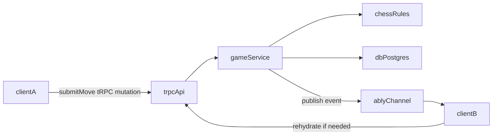
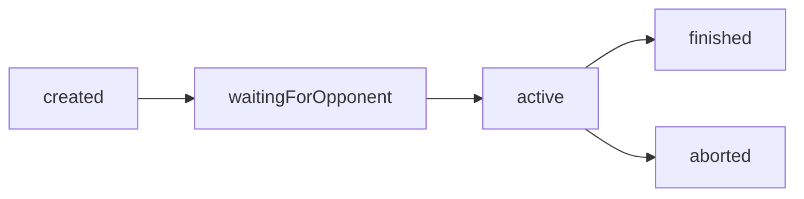

# Verdict

Verdict is a modern competitive chess platform built with the T3 stack, focused on real-time timed multiplayer, profile-driven progression, and production-grade reliability. Instead of a simple chessboard demo, Verdict centers on authoritative game state, fair clock handling, rating updates by time control, and meaningful player statistics.

## Tech Highlights

- Next.js App Router + TypeScript
- tRPC end-to-end typed API contracts
- Drizzle ORM + PostgreSQL relational model
- Better Auth session and identity model
- Managed realtime (Ably) event contract
- Server-authoritative clock and game-result engine

## Product Scope

### MVP (Implemented Foundation)

- Authentication and session identity
- Lobby create/join via invite code
- Live 1v1 game state endpoints
- Server-side move validation with `chess.js`
- Authoritative clock model (`remainingMs` + `lastClockStartedAt`)
- Game lifecycle with terminal reasons
- Elo ratings by time class (`bullet`, `blitz`, `rapid`, `classical`)
- Player statistics and game history routes
- Profile routes and initial profile pages

### Post-MVP

- Matchmaking queue
- Leaderboards
- Presence and richer social features
- Spectator mode
- Analysis board and puzzles

## Architecture

### Realtime Flow

### Game Lifecycle

Terminal reason model:

- `checkmate`
- `stalemate`
- `draw_agreement`
- `threefold`
- `fifty_move`
- `timeout`
- `resignation`
- `aborted`

## Repository Structure

- `src/app` - route entry points and pages
- `src/features/game` - board UI and live game client
- `src/features/play` - lobby creation/join UI
- `src/features/profile` - public profile UI
- `src/server/api/routers` - domain tRPC routers
- `src/server/services` - game lifecycle, realtime, rating, progression logic
- `src/server/db` - Drizzle schema and DB client
- `docs/MVP_SCOPE.md` - explicit MVP scope freeze
- `docs/REALTIME_ARCHITECTURE.md` - realtime recommendation and event contract

## Core API Procedures

- `lobby.create`
- `lobby.joinByCode`
- `lobby.listOpen`
- `game.getById`
- `game.submitMove`
- `game.resign`
- `game.offerDraw`
- `game.respondDraw`
- `game.requestRematch`
- `profile.upsert`
- `profile.getPublic`
- `profile.getMyStats`
- `history.listMyGames`

## Quick Start

### Prerequisites

- Node.js 20+
- `pnpm` 8+
- Docker or Podman (for local PostgreSQL)

### 1) Install dependencies

- `pnpm install`

### 2) Configure env

- `cp .env.example .env`
- Fill in:
  - `BETTER_AUTH_SECRET`
  - `DATABASE_URL` (default works with local container script)
  - Optional for GitHub OAuth:
    - `BETTER_AUTH_GITHUB_CLIENT_ID`
    - `BETTER_AUTH_GITHUB_CLIENT_SECRET`

### 3) Start PostgreSQL

- `./start-database.sh`

### 4) Apply schema

- `pnpm db:push`

### 5) Run the app

- `pnpm dev`
- Open [http://localhost:3000](http://localhost:3000)

### Useful commands

- `pnpm typecheck`
- `SKIP_ENV_VALIDATION=1 pnpm lint`
- `pnpm db:studio`

## Environment Variables

- `DATABASE_URL`
- `BETTER_AUTH_SECRET`
- `BETTER_AUTH_GITHUB_CLIENT_ID` (optional, enables GitHub sign-in)
- `BETTER_AUTH_GITHUB_CLIENT_SECRET` (optional, enables GitHub sign-in)
- `ABLY_API_KEY` (optional in local MVP)
- `NEXT_PUBLIC_ABLY_KEY` (optional in local MVP)

## Milestones

1. Foundation schema + game lifecycle
2. Live game flow + clocks
3. Ratings and profile progression
4. UI polish and portfolio assets

